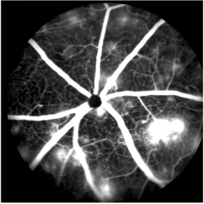
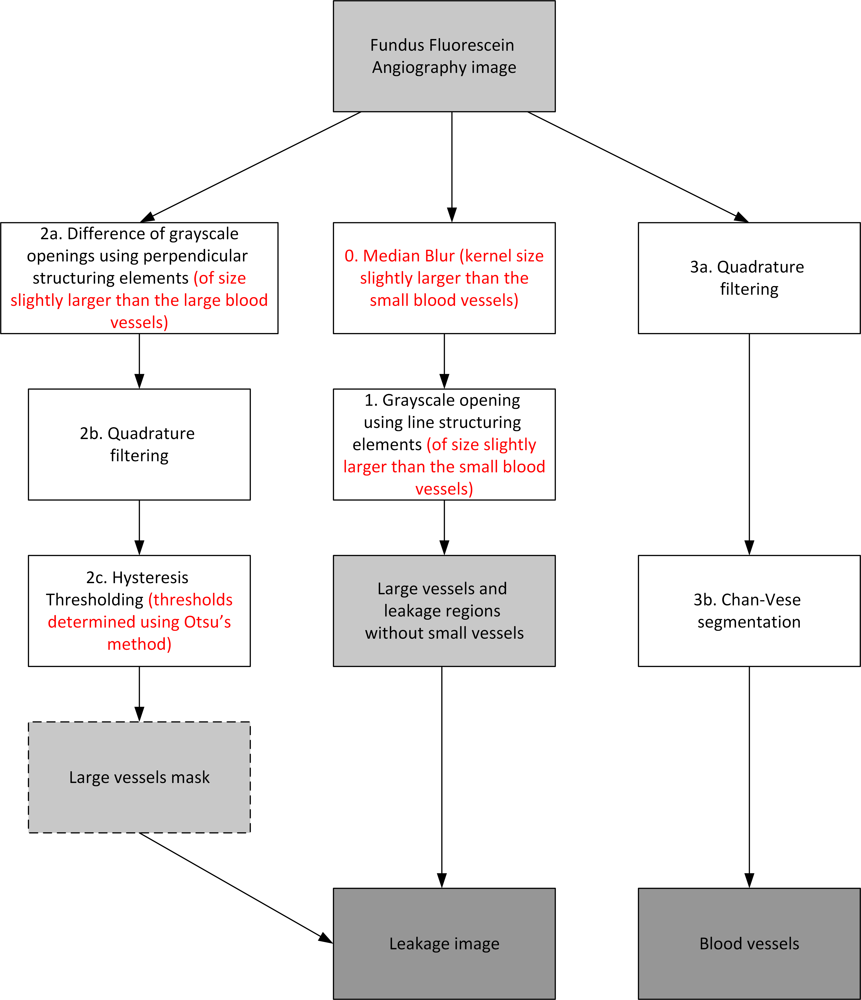
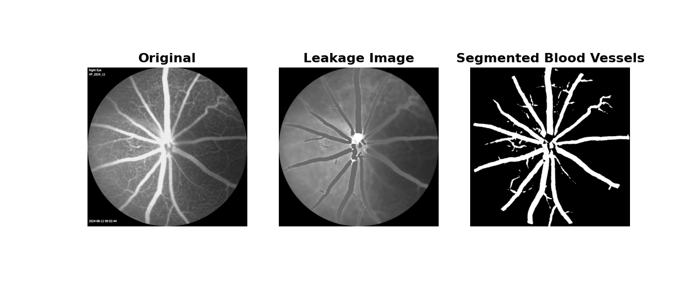

# FFA Image Analysis (ffa_analysis) version 0.1.0



## Introduction

This python project provides a module (`ffa_analysis`) that segments Fundus fluorescein angiography images, referencing the 2021 paper *Quantification of retinal blood leakage in fundus fluorescein angiography in a retinal angiogenesis model* by Comin et al.

Many severe eye diseases involve retainal bleeding, and studying these diseases require analyzing retinal images of mouse models. One particular form of retinal imaging is Fundus flourescein angiography (FFA), which involves injecting a flourescent dye into the bloodstream and taking in vivo retinal images. The resulting image is grayscale, the foreground being a network of large and small blood vessels converging near the optical nerve. In diseased mice, these FFA images also include blood leakages, which show up as bright blobs.

The python module provided here takes an FFA image and several output images: leakage regions and the segmented blood vessels (large and small). The module uses a combination of image processing techniques: it uses morphological openings using line structuring elements, log Gabor quadrature filters and hysterisis thresholding to identify the leakage regions, while it uses log Gabor quadrature filters and the Chan-Vese graph cut segmentation algorithm to segment blood vessels, both large and small. Below is the algorithm flowchart from the paper, with my added modifications in red.



## Usage
Feel free to download the python module `ffa_analysis.py`. Afterwards, you can run the module by
```
python ffa_analysis.py [-h] [-l LARGE_VESSEL_SIZE] [-s SMALL_VESSEL_SIZE]
                       [-m MEDIAN_BLUR_RADIUS] [-i {leakage,vessels,both}]
                       [-o OUTPUT_DIR] [-d] [-v]
                       input_file
```

## Sample Result
Behold!
```
python ffa_analysis.py resources\testing\test_img.jpg -l 49 -s 15 -m 19 -v -d -o resources\testing\output
```



## More to Come
The next version will include reference point determination and image registration for a sequence of FFA images taken at several time points.

## Works Cited
Comin, C. H., Tsirukis, D. I., Sun, Y., & Xu, X. (2021). Quantification of retinal blood leakage in fundus fluorescein angiography in a retinal angiogenesis model. *Scientific Reports, 11*(1). https://doi.org/10.1038/s41598-021-99434-2 